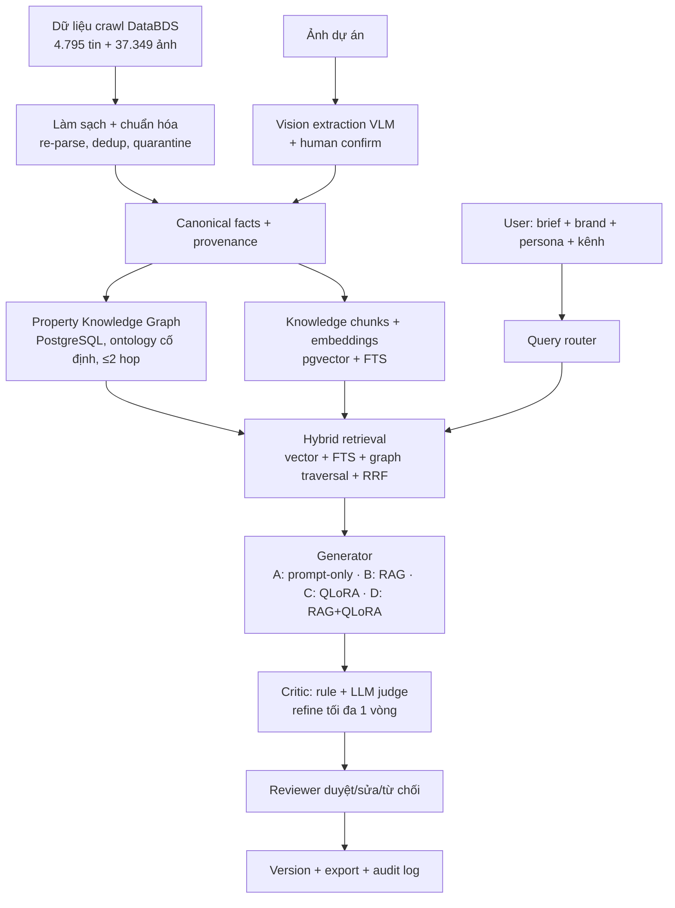

# 01 — Kế hoạch tổng thể ĐATN

## Xây dựng hệ thống AI đa phương thức hỗ trợ tạo và tối ưu nội dung marketing bất động sản từ dữ liệu thu thập bằng RAG và mô hình ngôn ngữ được tinh chỉnh

| | |
|---|---|
| **Tên tiếng Anh** | Developing a multimodal AI system for generating and optimizing real estate marketing content from collected data using RAG and fine-tuned language models |
| **Sinh viên** | Lê Văn Quang (25410011) · Phạm Vũ Hải (25410005) — LT.K2025.1.TTNT |
| **GVHD** | Cáp Phạm Đình Thăng |
| **Mốc cứng** | Nộp báo cáo **24/09/2026** · Bảo vệ **10/10/2026** |
| **Bộ tài liệu** | [02 — Kế hoạch dữ liệu](02_KE_HOACH_DU_LIEU.md) · [03 — Kế hoạch thực nghiệm](03_KE_HOACH_THUC_NGHIEM.md) · [04 — Đề cương trình bày](04_DE_CUONG_TRINH_BAY.md) |

---

## 1. Định vị học thuật (câu trả lời khi hội đồng hỏi "đề tài này là gì?")

> Đây là hệ thống **sinh nội dung có kiểm soát, đa phương thức, có truy xuất căn cứ (retrieval-grounded controllable generation)** cho marketing bất động sản tiếng Việt đa kênh: mọi nội dung sinh ra đều bám vào facts có nguồn, được điều khiển theo thương hiệu/persona/kênh, và được đánh giá bằng thực nghiệm có kiểm soát — không phải một ứng dụng "gọi API viết content".

Đề tài trả lời câu hỏi trung tâm: **RAG và fine-tuning (QLoRA) — mỗi kỹ thuật đóng góp gì, và kết hợp có tốt hơn không** — trên một bài toán tiếng Việt có dữ liệu tự thu thập, pipeline tự xây và benchmark tự thiết kế.

### Bốn đóng góp chính

1. **Bộ dữ liệu tiếng Việt có cấu trúc** cho bài toán sinh nội dung marketing BĐS đa kênh: 4.795 tin đăng + 37.349 ảnh tự crawl, được làm sạch, gắn provenance, chia tập chống leakage (chi tiết ở [02](02_KE_HOACH_DU_LIEU.md)).
2. **Cơ chế sinh có kiểm soát** theo `facts + brand + persona + channel + visual evidence`: mỗi claim trong output phải map về fact có nguồn; claim không căn cứ bị loại hoặc cảnh báo.
3. **Property Knowledge Graph trên PostgreSQL** kết hợp hybrid vector RAG: truy xuất được câu hỏi quan hệ nhiều bước (căn hộ → tòa → tiện ích) kèm đường đi giải thích được, không cần graph database riêng.
4. **Benchmark so sánh có kiểm soát**: 4 cấu hình sinh A–D và 3 cấu hình truy xuất R1–R3, đánh giá bằng metric tự động + human evaluation mù, tái lập được (protocol ở [03](03_KE_HOACH_THUC_NGHIEM.md)).

## 2. Câu hỏi nghiên cứu

| RQ | Nội dung | Trả lời bằng |
|---|---|---|
| RQ1 | RAG có tăng tỷ lệ claim được nguồn hỗ trợ và giảm hallucination so với prompt-only không? | A vs B, C vs D |
| RQ2 | QLoRA SFT có tăng channel fit / persona fit / brand consistency so với model gốc không? | A vs C, B vs D |
| RQ3 | RAG + fine-tuned có tốt hơn từng kỹ thuật riêng lẻ không? | D vs A/B/C |
| RQ4 | Visual facts từ ảnh có cải thiện độ phù hợp ảnh–nội dung mà không tăng claim sai không? | D vs D+V (ablation) |
| RQ5 | Critic–refiner một vòng có tăng tỷ lệ thỏa ràng buộc với chi phí chấp nhận được không? | D+V vs D+V+R (ablation) |
| RQ6 | Property Knowledge Graph + hybrid RAG có cải thiện truy xuất câu hỏi quan hệ và khả năng giải thích so với vector RAG thuần không? | R1 vs R2 vs R3 |

RQ và metric được **khóa trước khi chạy thí nghiệm cuối** — không chọn metric theo kết quả.

## 3. Sản phẩm bắt buộc

Web app online (URL thật, HTTPS) gồm:

1. Đăng nhập, phân quyền `admin` / `marketer` / `reviewer`, tenant isolation ở backend.
2. Quản lý dự án BĐS, loại căn, tài liệu, ảnh, brand guideline, persona.
3. Sinh **4 loại nội dung**: mô tả dự án/căn hộ · bài Facebook · email nurturing · landing page SEO.
4. **Evidence panel**: facts, chunks, ảnh và graph path đã dùng cho từng nội dung (ví dụ: `Căn 2PN → Tòa S2 → gần trường học`), kèm nguồn.
5. Kiểm tra tự động: claim, ràng buộc kênh, giọng thương hiệu, SEO cơ bản.
6. Sửa / duyệt / từ chối, version history, export.
7. Dashboard so sánh các cấu hình thí nghiệm A–D, R1–R3.

**Không làm trong MVP:** huấn luyện foundation model, fine-tune vision, tự đăng bài lên nền tảng, A/B online bằng traffic thật, xử lý video, DPO (chỉ làm nếu mọi thứ khác đã ổn định).

## 4. Kiến trúc chốt

### 4.1. Luồng cốt lõi

### 4.2. Quyết định kiến trúc đã khóa (không tự ý thay đổi)

- **Lõi production:** PostgreSQL + pgvector duy nhất — lưu transactional data, vector, FTS, node và edge của Property Graph. Không dùng Neo4j, không dịch vụ graph riêng.
- **Graph traversal ≤ 2 hop** (recursive CTE) để kiểm soát latency và semantic drift.
- **Ontology cố định** — LLM không được phát minh loại entity/edge. Node: `Developer, Project, Zone, Building, UnitType, Amenity, Location, Transport, Persona, BrandRule, Claim, Source, DocumentChunk, Image`. Edge: `DEVELOPS, PART_OF, HAS_BUILDING, HAS_UNIT_TYPE, LOCATED_IN, NEAR, HAS_AMENITY, CONNECTED_BY, SUITABLE_FOR, SUPPORTED_BY, CONTRADICTS, MENTIONED_IN, DEPICTS`.
- **Mọi fact/edge/claim có provenance** (`source_id`, trích đoạn, thời điểm, parser version); dữ liệu nhạy cảm theo thời gian (giá, khuyến mãi) có `valid_from`/`valid_to`, không ghi đè giá trị cũ.
- **Facts sống trong retrieval; style/format/persona học bằng SFT** — đây là luận điểm thiết kế trung tâm của đồ án.
- **Vision** chỉ trích xuất visual facts hẹp (loại phòng, vật thể nhìn thấy, vật liệu/màu) kèm confidence + human confirmation; cấm suy đoán pháp lý, vị trí, giá từ ảnh.
- **Đã cắt khỏi phạm vi:** Microsoft GraphRAG (R4) — không nằm trong đề cương, chi phí index cao, không phục vụ RQ chính.

### 4.3. Stack

| Tầng | Công nghệ | Ghi chú |
|---|---|---|
| Frontend | Next.js + TypeScript | Deploy managed hosting |
| Backend | FastAPI + Pydantic + SQLAlchemy/Alembic | Container |
| Database | PostgreSQL + pgvector | Managed; exact search trước, HNSW chỉ khi benchmark cần |
| Storage | S3-compatible | Ảnh/tài liệu; DB chỉ giữ metadata |
| Embedding | `BAAI/bge-m3` (ứng viên) | Phải benchmark trên 50–100 query tiếng Việt trước khi chốt |
| Generator nghiên cứu | Open model 7B–8B, ứng viên Qwen3-8B + QLoRA | Chốt bằng pilot, xem [03 §3](03_KE_HOACH_THUC_NGHIEM.md) |
| Generator demo | API (OpenAI/Claude) qua model gateway | Không thay thế kết quả thí nghiệm open model |
| Critic | Rule engine + LLM judge độc lập | Judge không xem reference khi chấm factuality |
| Training/eval | Transformers, PEFT, TRL, bitsandbytes, MLflow/W&B | Log đầy đủ để tái lập |

### 4.4. Module backend

`auth/rbac` · `users/tenants` · `projects/units/assets` · `brands/personas` · `ingestion/normalization` · `vision` · `retrieval` · `knowledge_graph` (entity_resolution + traversal) · `generation` · `evaluation` · `content_versions/reviews` · `experiments/audit_logs`

## 5. Ma trận thí nghiệm

### 5.1. Sinh nội dung (bắt buộc theo đề cương)

| ID | Retrieval | Fine-tuned | Vision facts | Critic-refiner |
|---|:---:|:---:|:---:|:---:|
| **A** | — | — | — | — |
| **B** | ✓ | — | — | — |
| **C** | — | ✓ | — | — |
| **D** | ✓ | ✓ | — | — |
| D+V *(ablation)* | ✓ | ✓ | ✓ | — |
| D+V+R *(ablation)* | ✓ | ✓ | ✓ | ✓ |

### 5.2. Truy xuất

| ID | Vector/FTS | Property Graph | Mục tiêu |
|---|:---:|:---:|---|
| **R1** | ✓ | — | Baseline vector retrieval |
| **R2** | — | ✓ | Đo graph-only và chất lượng path |
| **R3** | ✓ | ✓ | Cấu hình production chốt |

**Giả thuyết chính:** RAG chủ yếu cải thiện độ đúng dữ kiện; QLoRA chủ yếu cải thiện tuân thủ phong cách/cấu trúc; kết hợp cho kết quả tổng thể tốt nhất; graph bổ sung khả năng trả lời câu hỏi quan hệ và giải thích đường đi.

## 6. Lộ trình 8 tuần (đánh số tương đối)

> Nguyên tắc: mỗi tuần bắt đầu bằng **kiểm tra checkpoint tuần trước bằng bằng chứng thật** (file/test/URL), kết thúc bằng demo chạy được trên staging. Không đánh dấu hoàn thành dựa trên kế hoạch. Dữ liệu DataBDS **đã có sẵn** nên Tuần 1 gộp setup + ingestion, không chờ crawler.

| Tuần | Mục tiêu | Deliverables chính | Gate cuối tuần | Quang | Hải |
|---|---|---|---|---|---|
| **1** | Nền tảng + ingestion DataBDS | Monorepo FastAPI+Next.js; PostgreSQL+pgvector migrations; auth/RBAC/tenant; project CRUD; adapter đọc DataBDS → raw zone; staging URL | Đăng nhập trên staging, import ≥100 tin DataBDS không sửa tay, tạo/xem project | Monorepo, DB, auth, CI/CD, staging | Audit chất lượng DataBDS, khóa contract v1, spec re-parse |
| **2** | Làm sạch + canonical + graph | Pipeline re-parse/normalize/dedup/quarantine (D1–D3 trong [02 §4](02_KE_HOACH_DU_LIEU.md)); canonical facts + provenance; graph entities/edges deterministic; chạy lặp idempotent | Chạy lại cùng batch không sinh duplicate; query được path `Project → Building → UnitType` bằng dữ liệu thật; báo cáo data quality | Ingestion jobs, schema graph, quarantine UI | Re-parse rules, dedup, data quality report |
| **3** | Knowledge base + dataset v1 | Chunking + embeddings + FTS index; entity resolution + alias; split 70/15/15 theo project + leakage audit; SFT draft v1; 60–90 gold retrieval queries | `dataset_v1` có data card + split cố định; R1 và R2 trả kết quả đúng project kèm nguồn | Fact/source editor, indexing pipeline, traversal API | Dataset builder, split, gold queries, SFT draft |
| **4** | Baseline A/B + Content Studio | Query router; R3 context assembler (RRF); prompt versions khóa; Content Studio 4 kênh; Evidence panel; generation logging | A và B chạy end-to-end trên web; bảng so sánh R1–R3 đầu tiên; UI giải thích ≥1 graph path | Router, assembler, Studio, Evidence UI | Retrieval benchmark, prompt baseline, metrics |
| **5** | QLoRA + reviewer flow | Pilot backbone (2–3 model) → chọn chính thức; QLoRA main run; cấu hình C chạy được; editor/approve/reject/version/export | Adapter load độc lập, C sinh output trên frozen validation; reviewer flow đầy đủ trên staging | Reviewer/version/export UI+API | Pilot, QLoRA train, log thí nghiệm |
| **6** | Tích hợp D + đánh giá chính | Model gateway; cấu hình D; chạy frozen A–D + R1–R3; comparison dashboard; human evaluation mù | Bảng kết quả tái lập được từ script; mọi run có snapshot version | Gateway, experiment config, dashboard | Chạy eval, tổng hợp metrics, thống kê |
| **7** | Vision + critic + hardening | VLM extraction + UI xác nhận visual facts; critic panel; ablation D+V (và D+V+R nếu kịp); RBAC/UX hardening | Ảnh tạo facts có confidence/provenance; output không dùng visual claim chưa xác nhận | Confirm UI, critic panel, hardening | Vision benchmark, image-text consistency |
| **8** | Release candidate | E2E + security test; deploy production; seed demo data; model/data card; reproducibility package; rehearsal demo | URL production đầy đủ luồng chính; demo chạy trên máy khác/mạng khác; backup video | Deploy, E2E, runbook | Figures/tables, cards, repro package |

**Sau Tuần 8 → nộp báo cáo:** viết chương dữ liệu/phương pháp/hệ thống/thực nghiệm/kết quả/đạo đức/hạn chế; sinh sơ đồ và bảng từ artefact thật; chụp UI từ production; chuẩn bị theo [04](04_DE_CUONG_TRINH_BAY.md).

## 7. Phân công tổng thể

| | Lê Văn Quang | Phạm Vũ Hải |
|---|---|---|
| **Vai trò** | Hệ thống và tích hợp sản phẩm | Dữ liệu và mô hình |
| **Phụ trách** | Kiến trúc web app, backend/frontend, database, auth/RBAC/tenant, graph storage/traversal, hybrid retrieval, CI/CD, dashboard, deployment, runbook | Crawler + data contract, làm sạch/chuẩn hóa, SFT dataset, QLoRA fine-tuning, retrieval/generation evaluation, vision data, phân tích kết quả |
| **Viết báo cáo** | Chương thiết kế + triển khai hệ thống | Chương dữ liệu + mô hình + kết quả thực nghiệm |

## 8. Nguyên tắc giữ phạm vi

**Nếu trễ, cắt theo thứ tự:**
1. DPO/preference training
2. Ablation D+V+R (critic-refiner)
3. Video script / đa ngôn ngữ
4. Reranker riêng, agent nhiều bước
5. Graph visualization nâng cao
6. Ablation D+V (vision) — cắt cuối cùng trong nhóm nghiên cứu mở rộng

**Không được cắt:** deploy online · auth/RBAC · quản lý user/project · **A–D** · **QLoRA** · **Property Knowledge Graph + hybrid RAG (R1–R3)** · provenance/evidence · review/version/export · frozen evaluation.

## 9. Rủi ro chính

| Rủi ro | Dấu hiệu sớm | Phương án |
|---|---|---|
| Dữ liệu parse hỏng làm chậm pipeline | Tuần 2 chưa có canonical facts sạch | Re-parse từ title/description/URL đã có sẵn local (không crawl lại); quarantine field hỏng, không chặn batch |
| Không đủ GPU cho QLoRA | Pilot OOM / quá lâu | Model nhỏ hơn, giảm sequence length, 4-bit, thuê GPU giờ, khóa budget |
| Fine-tune không hơn baseline | Validation không cải thiện | Báo negative result trung thực + phân tích lỗi; không đổi test set |
| RAG lấy sai project | Evidence mismatch | Metadata filter bắt buộc theo `project_id`; retrieval eval trước generation |
| Entity resolution merge sai | Node chứa dữ liệu nhiều dự án | Canonical key + alias + confidence + human review; không auto-merge case mơ hồ |
| Human evaluation thiếu người | Tuần 6 chưa chốt rater | Chốt lịch từ Tuần 3; giảm test set nhưng giữ blind/paired protocol |
| API ngoài lỗi/đắt | Timeout/rate limit | Gateway + retry giới hạn + cache + budget cap + video demo dự phòng |
| Deploy muộn | Hết Tuần 2 chưa có staging | Deploy skeleton từ Tuần 1, không chờ AI pipeline |

## 10. Definition of Done (toàn đồ án)

- **Data:** raw/clean/SFT/benchmark có version + data card; provenance đầy đủ; split theo project có báo cáo leakage. → chi tiết [02](02_KE_HOACH_DU_LIEU.md)
- **Model:** adapter QLoRA + config + seed + log + model card; script train/eval chạy lại được; A–D cùng frozen test set. → chi tiết [03](03_KE_HOACH_THUC_NGHIEM.md)
- **Product:** URL online, HTTPS, RBAC backend; 4 kênh nội dung + evidence + review/version/export; retrieval production = R3; audit log.
- **Research:** RQ/metric khóa trước; automatic + blind human eval; báo cáo cả negative results và giới hạn.
- **Demo:** kịch bản happy path 5–7 phút; kịch bản chống hallucination; màn hình so sánh A–D; video + dataset dự phòng. → kịch bản [04](04_DE_CUONG_TRINH_BAY.md)
